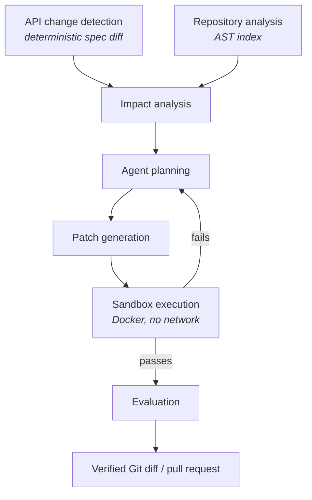

# Rewire

**An autonomous API migration and code-maintenance agent.**

APIs and SDKs change. Downstream code breaks. Rewire detects breaking API
changes, works out which code is affected, generates a migration patch, proves
the patch works by running it in an isolated sandbox, repairs it when it
doesn't, and hands back a verified Git diff.

The engineering here is deliberately *not* "prompt an LLM with the repo". Change
detection, repository indexing and impact analysis are deterministic — AST
parsing, static analysis and structured spec diffing. The LLM is used only where
reasoning and code generation are genuinely required, and it is never permitted
to declare its own success: correctness is decided by tests, type checks and
lints executed in a sandbox.

> **Status: Phase 0 — project foundation.** The build is incremental and each
> phase is finished, tested and documented before the next begins. See
> [docs/roadmap.md](docs/roadmap.md) for what exists today and what does not.
> Nothing in this README describes behaviour that is not implemented.

---

## Architecture



Each stage is an independently testable module under [`src/rewire/`](src/rewire/).

## Repository layout

```text
src/rewire/
  core/        settings, structured logging, error hierarchy, preflight checks
  changes/     API spec diffing and breaking-change classification   (Phase 1)
  analyzers/   AST-based repository indexing and usage extraction    (Phase 2)
  agents/      agent loop, tool definitions, run tracing             (Phase 4)
  llm/         provider-agnostic LLM abstraction                     (Phase 4)
  sandbox/     isolated patch execution and verification             (Phase 5)
  services/    pipeline orchestration                                (Phase 7)
  evals/       benchmark datasets, runners, metrics                  (Phase 8)
  gitio/       Git and GitHub integration                            (Phase 11)
  api/         FastAPI surface                                       (Phase 13)
  models/      persistence models and shared schemas
tests/         unit, integration and fixtures
evals/         datasets, runners, published results
docs/          architecture decisions and roadmap
```

## Install

Requires **Python 3.12+**, **Git**, and **Docker** (for sandboxed verification
from Phase 5 onward). [`uv`](https://docs.astral.sh/uv/) is recommended.

```bash
git clone <this-repo> && cd rewire
uv venv --python 3.12
uv pip install -e ".[dev]"
cp .env.example .env          # optional; every value has a safe default
```

With plain pip:

```bash
python3.12 -m venv .venv && source .venv/bin/activate
pip install -e ".[dev]"
```

## Verify your environment

```bash
uv run rewire doctor
```

`doctor` executes each dependency rather than merely checking that it exists —
it asks the Docker *daemon* for its version, not the Docker CLI for its path.
Required dependencies that fail exit non-zero; optional ones only warn.

```bash
uv run rewire doctor --json     # machine-readable report
uv run rewire config            # effective settings, secrets redacted
uv run rewire --version
```

## Configuration

All settings are typed ([`src/rewire/core/config.py`](src/rewire/core/config.py))
and read from the environment or a `.env` file. Variables are prefixed `REWIRE_`;
nested sections use a double underscore:

```bash
REWIRE_LOG_FORMAT=json
REWIRE_SANDBOX__MEMORY_LIMIT_MB=4096
REWIRE_LLM__PROVIDER=anthropic
```

API keys are held as `SecretStr` and are redacted in logs, `repr` and
`model_dump`. See [`.env.example`](.env.example) for every option.

## Development

```bash
uv run pytest                     # tests
uv run pytest --cov=src/rewire    # tests with coverage
uv run ruff check .               # lint
uv run ruff format .              # format
uv run mypy src                   # type check (strict)
uv run pre-commit install         # run all of the above on commit
```

Docker Compose provides a reproducible dev container and a Postgres instance for
later phases. The service has an empty entrypoint, so pass the full command:

```bash
docker compose run --rm rewire pytest -q      # tests in the container
docker compose run --rm rewire rewire doctor  # preflight in the container
docker compose run --rm rewire                # default: rewire doctor
```

The container runs as a non-root user, so it needs to join the group that owns
the Docker socket in order to launch sandboxes. That group is gid 0 under Docker
Desktop and the `docker` group on most Linux hosts:

```bash
DOCKER_GID=$(stat -c %g /var/run/docker.sock) docker compose run --rm rewire
```

## Design decisions

Recorded in [`docs/decisions.md`](docs/decisions.md). In short:

- **Deterministic before probabilistic.** Spec diffing and impact analysis are
  AST/static analysis, not LLM calls — they are cheaper, faster, reproducible
  and testable against ground truth.
- **The agent cannot grade itself.** Success is defined by sandbox evidence
  (tests, types, lints), never by the model's own claim.
- **Repository content is untrusted data.** Code Rewire reads may contain prompt
  injection; code Rewire runs may be hostile. It executes only inside a
  resource-limited, network-disabled container that never sees host secrets.
- **Evaluation is a feature, not an afterthought.** Every capability is measured
  against fixtures with known-correct answers.

## Limitations

Tracked honestly in [docs/roadmap.md](docs/roadmap.md). At Phase 0 the project
is a foundation: configuration, logging, errors, preflight checks, packaging,
tooling and CI-ready test infrastructure. No migration capability exists yet.

## Licence

MIT.
