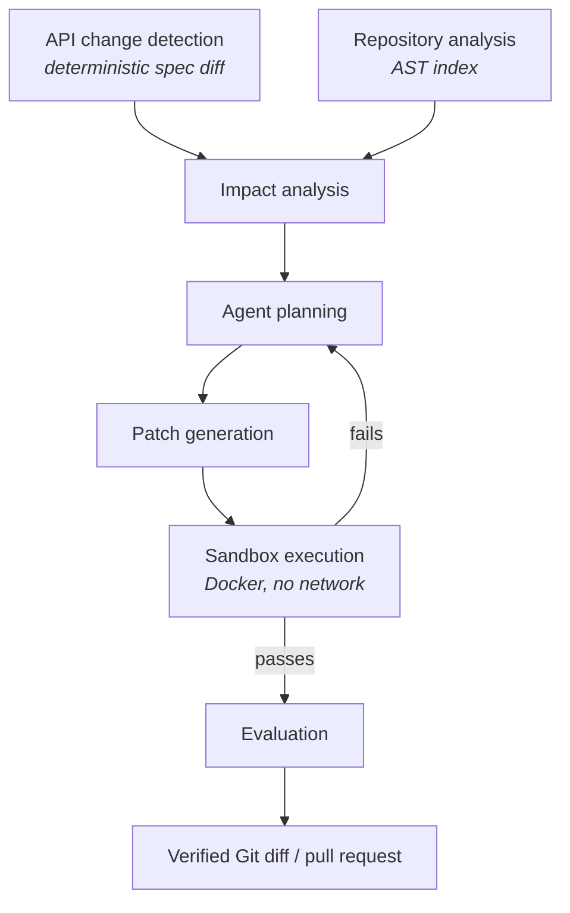

# Rewire

[](https://github.com/adamelkadri/rewire/actions/workflows/ci.yml)
[](https://www.python.org/)
[](#licence)

**An autonomous API migration and code-maintenance agent.**

APIs and SDKs change. Downstream code breaks. Rewire detects breaking API
changes, works out which code is affected, generates a migration patch, proves
the patch works by running it in an isolated sandbox, repairs it when it
doesn't, and hands back a verified Git diff.

The engineering here is deliberately *not* "prompt an LLM with the repo". Change
detection, repository indexing and impact analysis are deterministic — AST
parsing, static analysis and structured spec diffing. The LLM is used only where
reasoning and code generation are genuinely required, and it is never permitted
to declare its own success: correctness is decided by tests, type checks and
lints executed in a sandbox.

> **Status: Phase 5 — sandboxed verification.** Milestone 1 (core intelligence)
> is complete, an agent produces candidate patches, and those patches are now
> executed: `--verify` runs the repository's own tests, linter and type checker
> in a container with no network, before and after the patch, and only a run
> with passing tests and no regressions is called `VERIFIED`. What is still
> missing is repair — a failing check ends the run rather than being fed back
> (Phase 6). The build is incremental and each phase is finished, tested and
> documented before the next begins. See [docs/roadmap.md](docs/roadmap.md) for
> what exists today and what does not. Nothing in this README describes
> behaviour that is not implemented.

---

## Architecture



Each stage is an independently testable module under [`src/rewire/`](src/rewire/).

## Repository layout

```text
src/rewire/
  core/        settings, structured logging, error hierarchy, preflight checks
  changes/     API spec diffing and breaking-change classification   (Phase 1)
  analyzers/   AST indexing, name resolution, usage extraction       (Phase 2)
  agents/      agent loop, tool definitions, run tracing             (Phase 4)
  llm/         provider-agnostic LLM abstraction                     (Phase 4)
  sandbox/     isolated patch execution and verification             (Phase 5)
  services/    pipeline orchestration                                (Phase 7)
  evals/       benchmark datasets, runners, metrics                  (Phase 3)
  gitio/       Git and GitHub integration                            (Phase 11)
  api/         FastAPI surface                                       (Phase 13)
  models/      persistence models and shared schemas
tests/         unit, integration and fixtures
evals/         datasets, runners, published results
docs/          architecture decisions and roadmap
```

## Install

Requires **Python 3.12+**, **Git**, and **Docker** (for sandboxed verification
from Phase 5 onward). [`uv`](https://docs.astral.sh/uv/) is recommended.

```bash
git clone https://github.com/adamelkadri/rewire && cd rewire
uv sync --locked --all-extras
cp .env.example .env          # optional; every value has a safe default
```

`--locked` installs exactly the versions in `uv.lock`, which is what CI does
too, so local results and CI results cannot diverge.

With plain pip:

```bash
python3.12 -m venv .venv && source .venv/bin/activate
pip install -e ".[dev]"
```

## Detect breaking API changes

```bash
uv run rewire api-diff old-spec.yaml new-spec.yaml
```

Compares two OpenAPI 3.x documents (YAML or JSON) and reports every difference,
graded by how much downstream code it breaks. Fully deterministic — no LLM, no
network, identical output every run.

Against the bundled fixture modelling OpenAI's `max_tokens` migration:

```text
POST /v1/chat/completions
┏━━━━━━━━━━━━━━┳━━━━━━━━━━━━━━━━━━━━━━━━━━━━━━━━┳━━━━━━━━━━━━━━━━━━━━━━━━━━━━━━┓
┃ Severity     ┃ Change                         ┃ Field                        ┃
┡━━━━━━━━━━━━━━╇━━━━━━━━━━━━━━━━━━━━━━━━━━━━━━━━╇━━━━━━━━━━━━━━━━━━━━━━━━━━━━━━┩
│ breaking     │ request_field_removed          │ max_tokens ->                │
│              │                                │ max_completion_tokens        │
│ breaking     │ response_field_became_optional │ usage.completion_tokens      │
│ potentially  │ response_schema_changed        │ choices[].finish_reason      │
│ non-breaking │ request_schema_changed         │ messages[].role              │
└──────────────┴────────────────────────────────┴──────────────────────────────┘
```

Three things in that output are worth calling out, because they are where a
naive differ gets it wrong:

- **`max_tokens -> max_completion_tokens`.** A raw diff sees one field removed
  and an unrelated one added. Rewire links them by token-overlap similarity
  gated on schema compatibility, so the downstream migration is
  "replace X with Y" rather than two disconnected facts.
- **`usage.completion_tokens` became optional → breaking.** Nothing was removed
  and no type changed, so most tools grade this harmless. It means the field may
  now be absent from a response the client already reads, making every unguarded
  access a latent `KeyError`.
- **`finish_reason` gained an enum value → potentially breaking, but
  `messages[].role` gaining one → non-breaking.** The same edit, graded
  differently by direction: a client can safely *send* a value the server already
  accepted, but may not handle *receiving* one it has never seen.

That asymmetry is systematic, not case-by-case — see
[ADR-010](docs/decisions.md).

Machine-readable output and CI gating:

```bash
uv run rewire api-diff old.yaml new.yaml --json
uv run rewire api-diff old.yaml new.yaml --min-severity breaking
uv run rewire api-diff old.yaml new.yaml --fail-on breaking   # exits 1 in CI
```

```json
{
  "type": "request_field_removed",
  "severity": "breaking",
  "endpoint": "POST /v1/chat/completions",
  "field": "max_tokens",
  "replacement": "max_completion_tokens"
}
```

## Understand a repository

```bash
uv run rewire analyze ./example-repo
uv run rewire search ./example-repo max_tokens
```

`analyze` parses every Python file and records imports, definitions, call sites,
name references, environment reads, declared dependencies and entry points. No
LLM, no embeddings — Python's own AST.

The reason it parses rather than greps is that one SDK call has many spellings:

```python
client.chat.completions.create(...)  # module-level instance
self._client.chat.completions.create(...)  # attribute assigned in __init__
oai.chat.completions.create(...)  # aliased module import
```

Rewire tracks what each name is bound to — through imports, aliases, assignment
chains and `self.x` attributes — and rewrites all three into
`openai.OpenAI.chat.completions.create`. One query finds all of them:

```python
>>> index = build_index("./example-repo")
>>> len(index.find_calls("openai.OpenAI.chat.completions.create"))
3
```

`search` runs both strategies side by side, which shows what parsing buys:

```text
AST references
┏━━━━━━━━━━━━━━━━━━━━━━━━━━┳━━━━━━━━━━━━━━━━━━┳━━━━━━━━━━┳━━━━━━━━━━━━━━━━━━━━━┓
┃ Location                 ┃ Kind             ┃ Evidence ┃ Context             ┃
┡━━━━━━━━━━━━━━━━━━━━━━━━━━╇━━━━━━━━━━━━━━━━━━╇━━━━━━━━━━╇━━━━━━━━━━━━━━━━━━━━━┩
│ src/chatapp/client.py:25 │ parameter        │      0.7 │ generate            │
│ src/chatapp/client.py:26 │ keyword_argument │      1.0 │ ...completions.crea │
│ src/chatapp/client.py:64 │ dict_key         │      0.9 │ build_payload       │
└──────────────────────────┴──────────────────┴──────────┴─────────────────────┘
```

Text search reports seven matching lines. AST search reports the same
occurrences *classified*: a keyword argument on an SDK call is near-certain
evidence of the API field, while the same token in a comment is nearly none.
Phase 3 turns those weights into confidence scores — see
[ADR-015](docs/decisions.md).

Text search remains available and is a real implementation, not a stub: ripgrep
when installed, a pure-Python scanner when not, both held to the same contract
and asserted to produce identical results.

```bash
uv run rewire analyze ./repo --json | jq '.stats'
uv run rewire search ./repo max_tokens --mode ast --kind keyword_argument
uv run rewire search ./repo 'max_\w+' --mode text --regex
```

## Find the code an API change breaks

```bash
uv run rewire impact ./repo --old old-spec.yaml --new new-spec.yaml --explain
```

Joins the change report to an AST index of the repository and ranks every
candidate location. Still no LLM, and nothing is modified — this command reports.

```text
request_field_removed — max_tokens -> max_completion_tokens  breaking  POST /v1/chat/completions

Conf  Location                Symbol                        Code
1.00  app/client.py:14        app.client.ask                max_tokens=max_tokens,
1.00  app/summariser.py:14    app.summariser.Summariser.run max_tokens=64,
1.00  app/client.py:23        app.client.ask_with_payload    "max_tokens": 512,
0.96  app/client.py:10        app.client.ask                def ask(prompt, max_tokens=256)
0.88  tests/test_client.py:7  tests.test_client.test_ask     assert ask("hi", max_tokens=10)
```

`--explain` shows why, because a bare `0.98` is not reviewable:

```text
app/client.py:14
  +2.0  argument to openai.OpenAI.chat.completions.create
  +1.6  occurs as a keyword argument
  +1.0  file imports openai
  +0.5  request field is written here
  +0.3  openai is a declared dependency
```

Confidence accumulates in **log-odds**, so weights add, evidence *against* is
just a negative weight, and the score saturates smoothly instead of piling up at
1.0 ([ADR-014](docs/decisions.md)). The signals that matter most:

- **A resolved call target (+2.0)** is the only signal connecting the *name* to
  the *library* rather than inferring it from proximity.
- **Direction agreement.** A request field is written; a response field is read.
  Getting this wrong made `choices[].message.role` match the `{"role": "user"}`
  in an outgoing request ([ADR-015](docs/decisions.md)).
- **Call-graph proximity (+1.2)** rescues a test one hop from the SDK, which
  imports no client library and would otherwise look exactly like a decoy.
- **No package attributed → no package signals at all.** Treating "does not
  import the SDK" as negative when Rewire never worked out *which* SDK would
  score every real call site as unaffected ([ADR-016](docs/decisions.md)).

## Measured accuracy

Impact analysis is scored against labelled ground truth checked into
[`evals/datasets/impact/`](evals/datasets/impact/):

```bash
uv run rewire eval impact          # writes evals/results/latest.{json,md}
```

| Granularity | Precision | Recall | F1 | TP | FP | FN |
| --- | --- | --- | --- | --- | --- | --- |
| location | 1.000 | 1.000 | 1.000 | 9 | 0 | 0 |
| file | 1.000 | 1.000 | 1.000 | 6 | 0 | 0 |

**Read that with the sample size in mind: five cases, nine expected locations.**
A perfect score there means the obvious failure modes are handled, not that the
analyser is accurate in the wild. The number is published with its counts for
exactly that reason, and expanding the benchmark is Phase 8's job.

The cases are chosen to be able to fail in different ways: three SDK call styles
in one repository; a `decoys` case where the field name appears on a local
helper, an unrelated dict, a log string and a *different* library; a `raw_http`
case with no SDK installed at all; a `response_field` case that both reads and
constructs the same field; and an `unrelated` case that expects **nothing** —
without which an analyser that reported every occurrence of every name would
score respectable F1.

Building this is also what found the bugs. It caught keyword arguments being
recorded at the *call's* line rather than their own — invisible on the
single-line calls in the unit tests, wrong on essentially every real SDK call.

## Propose a migration

```bash
uv run rewire propose ./repo --old old-spec.yaml --new new-spec.yaml
```

Runs everything above — spec diff, AST index, impact analysis — and only then
calls a model, handing it those findings plus eight read-and-propose tools.

```text
CANDIDATE  agent proposed a patch
  4 iteration(s), 9 tool call(s) (0 error(s)), 3 file(s) changed
  9658 tokens (2818 in / 568 out), cost $0.0206, 7.3s

Files changed
  app/client.py      +2 -2
  app/summariser.py  +1 -1
  tests/test_client.py  +1 -1

This patch is a proposal. Rewire has not executed it: no tests were run and
nothing was written to your repository. Run with --verify to execute the
repository's own checks against it in a sandbox.
```

Three design choices carry this phase:

- **The agent cannot mark its own work successful.** The best terminal state is
  `CANDIDATE`, the output type is `CandidatePatch`, and `verified` returns
  `False` unconditionally. The first live run justified the caution: the model's
  summary claimed two edits in a file where the diff shows one
  ([ADR-021](docs/decisions.md)).
- **Edits are exact string replacements, not model-authored diffs.** Asking a
  model for a unified diff asks it to count lines; a large share of such agents'
  failures are malformed hunks rather than bad reasoning. Rewire computes the
  diff, so it is always well formed — and `git apply` accepts it
  ([ADR-019](docs/decisions.md)).
- **Authority is bounded by the tool surface, not by the prompt.** Repository
  content never enters the system prompt and arrives only wrapped as untrusted
  data. Even a fully hijacked model can only call eight read-and-propose tools:
  no shell, no network, no write path ([ADR-020](docs/decisions.md)).

Provider is chosen by configuration alone, with no SDK type escaping
`rewire.llm`:

```bash
REWIRE_LLM__PROVIDER=openai     REWIRE_LLM__MODEL=gpt-4o
REWIRE_LLM__PROVIDER=anthropic  REWIRE_LLM__MODEL=claude-opus-5
```

Every run writes a JSONL trace under `.rewire/runs/<id>/` with each prompt, tool
call, token count and cost, flushed per event so a killed run still leaves
something readable.

## Prove the patch works

```bash
uv run rewire propose ./repo --old old.yaml --new new.yaml --verify
```

The patch is applied to a disposable copy inside a container and the
repository's own checks are executed — **twice**, once before the patch and once
after, so a regression means the patch caused it:

```text
VERIFIED  the test suite passed after the patch and no check regressed
Sandbox checks
┏━━━━━━━━━━━┳━━━━━━━━━━━━┳━━━━━━━━━┳━━━━━━━━━┳━━━━━━━━━━━━━━━━━━━━━━━━━━━━━━━━┓
┃ Check     ┃ Tool       ┃ Before  ┃ After   ┃ Detail                         ┃
┡━━━━━━━━━━━╇━━━━━━━━━━━━╇━━━━━━━━━╇━━━━━━━━━╇━━━━━━━━━━━━━━━━━━━━━━━━━━━━━━━━┩
│ tests     │ pytest     │ passed  │ passed  │ repository contains a test     │
│           │            │         │         │ suite                          │
│ typecheck │ mypy       │ skipped │ skipped │ repository does not configure  │
│           │            │         │         │ mypy                           │
│ lint      │ ruff       │ passed  │ passed  │ repository configures ruff     │
│ syntax    │ compileall │ passed  │ passed  │ always available; proves every │
│           │            │         │         │ file still parses              │
└───────────┴────────────┴─────────┴─────────┴────────────────────────────────┘

image python:3.12-slim, 18.1s, checks ran with no network
```

Given the same repository and a patch that renames the field in the source but
not in the test that asserts on it, the same command reports `REGRESSED`, names
`tests` as the regression, and exits non-zero. Both outcomes are asserted by an
integration test that runs against a real daemon.

Four things this design insists on:

- **The baseline is measured, not assumed.** Real repositories have a failing
  test and an unclean linter. Without a before-run, a verifier attributes the
  repository's existing state to the agent — invisible on hand-made fixtures,
  fatal to a benchmark ([ADR-023](docs/decisions.md)).
- **"Not checked" is not "passing".** A repository with no tests, a linter
  missing from the image, and a suite that timed out are three different
  statuses, and none of them is a pass. `VERIFIED` requires a test suite that
  actually ran ([ADR-024](docs/decisions.md)) — so `INCONCLUSIVE` exits non-zero
  just as `REGRESSED` does.
- **The isolation is tested by attacking it.** The container drops all
  capabilities, runs non-root on a read-only root filesystem with no network and
  hard memory/CPU/process ceilings. Integration tests open a socket, write
  outside the workspace and fork until the kernel refuses — and assert each
  attempt fails ([ADR-025](docs/decisions.md)).
- **Only installation may reach the network**, on its own reported step; a
  repository with no dependencies never goes online at all, and `--no-install`
  forces that ([ADR-026](docs/decisions.md)).

To measure a repository without involving an agent:

```bash
uv run rewire verify ./repo            # what do this repository's checks prove?
uv run rewire verify ./repo --no-install   # fully offline
```

## Verify your environment

```bash
uv run rewire doctor
```

`doctor` executes each dependency rather than merely checking that it exists —
it asks the Docker *daemon* for its version, not the Docker CLI for its path.
Required dependencies that fail exit non-zero; optional ones only warn.

```bash
uv run rewire doctor --json     # machine-readable report
uv run rewire config            # effective settings, secrets redacted
uv run rewire --version
```

## Configuration

All settings are typed ([`src/rewire/core/config.py`](src/rewire/core/config.py))
and read from the environment or a `.env` file. Variables are prefixed `REWIRE_`;
nested sections use a double underscore:

```bash
REWIRE_LOG_FORMAT=json
REWIRE_SANDBOX__MEMORY_LIMIT_MB=4096
REWIRE_LLM__PROVIDER=anthropic
```

API keys are held as `SecretStr` and are redacted in logs, `repr` and
`model_dump`. See [`.env.example`](.env.example) for every option.

## Development

```bash
uv run pytest                     # tests
uv run pytest --cov=src/rewire    # tests with coverage
uv run ruff check .               # lint
uv run ruff format --check .      # formatting, including Python in Markdown
uv run mypy src                   # type check (strict)
uv run pre-commit install         # run all of the above on commit
```

Every pre-commit hook runs from the project environment rather than from a
pinned mirror, so there is exactly one version of each tool and a hook cannot
pass locally while CI fails.

Docker Compose provides a reproducible dev container and a Postgres instance for
later phases. The service has an empty entrypoint, so pass the full command:

```bash
docker compose run --rm rewire pytest -q      # tests in the container
docker compose run --rm rewire rewire doctor  # preflight in the container
docker compose run --rm rewire                # default: rewire doctor
```

The container runs as a non-root user, so it needs to join the group that owns
the Docker socket in order to launch sandboxes. That group is gid 0 under Docker
Desktop and the `docker` group on most Linux hosts:

```bash
DOCKER_GID=$(stat -c %g /var/run/docker.sock) docker compose run --rm rewire
```

## Design decisions

Recorded in [`docs/decisions.md`](docs/decisions.md). In short:

- **Deterministic before probabilistic.** Spec diffing and impact analysis are
  AST/static analysis, not LLM calls — they are cheaper, faster, reproducible
  and testable against ground truth.
- **Severity is direction-aware.** A client produces requests and consumes
  responses, so the two vary oppositely. The grading is a lookup table, and a
  test fails if a new edit kind is added without a decision for both directions.
- **Unresolvable references are errors, not empty schemas.** Treating an
  unreadable `$ref` as `{}` makes two different documents compare equal — the
  one failure mode a breaking-change detector must never have.
- **Gaps are visible, never silent.** An unparseable file stays in the index
  carrying its error; an oversized repository is refused rather than truncated.
  Both protect the same invariant: Rewire must never report "no usages found"
  for code it did not read.
- **Repository content is untrusted.** Symlinks are never followed, file and
  total-size limits are enforced, and `setup.py` is not executed to read its
  dependencies.
- **The agent cannot grade itself.** Success is defined by sandbox evidence
  (tests, types, lints), never by the model's own claim.
- **Repository content is untrusted data.** Code Rewire reads may contain prompt
  injection; code Rewire runs may be hostile. It executes only inside a
  resource-limited, network-disabled container that never sees host secrets.
- **Evaluation is a feature, not an afterthought.** Every capability is measured
  against fixtures with known-correct answers.

## Limitations

Tracked honestly in [docs/roadmap.md](docs/roadmap.md). As of Phase 5:

- **OpenAPI 3.x only.** Swagger 2.0 is rejected with a message telling you to
  convert first. GraphQL, gRPC and hand-written SDK changelogs are not supported.
- **Single-file specs only.** External and remote `$ref`s raise an error rather
  than resolving; bundle multi-file specs first.
- **Renames sharing no tokens are not detected.** Stripe's `charge` →
  `payment_intent` is invisible to a name-based heuristic, and guessing would be
  worse than reporting the removal and addition separately.
- **Composition keywords are compared, not reasoned about.** Deciding whether
  two `oneOf` branches are compatible is a subtyping problem; Rewire reports the
  change and declines to guess at its severity beyond "potentially breaking".
- **Repository analysis is Python-only.** No JavaScript, TypeScript, Go or Java;
  tree-sitter is not yet wired in.
- **No type inference**, so a client obtained from a factory function
  (`get_client().create()`) is not traced to its library.
- **No cross-file call graph.** A call to a locally defined wrapper is recorded
  but not followed into the wrapper's body.
- **No index caching** — every command reparses the repository from scratch.
- **No repair loop.** A failing check ends the run; feeding the failure back to
  the agent and retrying is Phase 6.
- **Verification is not reproducible.** Dependencies are resolved fresh on every
  run against a floating image tag, so a patch verified today may verify
  differently next month. Phase 8 needs pinned images for published numbers.
- **Sandbox checks are Python-only.** A repository built with tox, nox, a
  Makefile or another language gets byte-compilation and nothing else.

## Licence

MIT.
