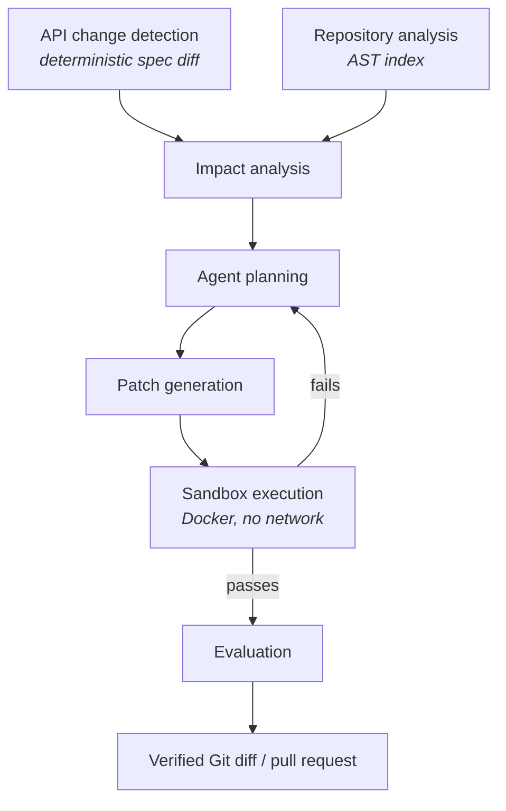

# Rewire

[](https://github.com/adamelkadri/rewire/actions/workflows/ci.yml)
[](https://www.python.org/)
[](#licence)

**An autonomous API migration and code-maintenance agent.**

APIs and SDKs change. Downstream code breaks. Rewire detects breaking API
changes, works out which code is affected, generates a migration patch, proves
the patch works by running it in an isolated sandbox, repairs it when it
doesn't, and hands back a verified Git diff.

The engineering here is deliberately *not* "prompt an LLM with the repo". Change
detection, repository indexing and impact analysis are deterministic — AST
parsing, static analysis and structured spec diffing. The LLM is used only where
reasoning and code generation are genuinely required, and it is never permitted
to declare its own success: correctness is decided by tests, type checks and
lints executed in a sandbox.

> **Status: measured, acting on what was measured, and now unattended.** The
> pipeline runs end to end, follows an upstream specification on a schedule, and
> is scored against a benchmark that grades each patch with a contract test the
> agent never sees. That benchmark found that **a third of the patches Rewire
> vouched for were wrong** — the agent satisfied the visible tests by weakening
> them — and that the rate barely moved across four models or four harness
> configurations. Rewire now refuses to call such a patch verified, using two
> deterministic checks whose first version *failed* and whose second was chosen
> from the traces of that failure. Re-measuring afterwards put the pooled rate at
> **25% (12–45%)**, an interval that overlaps the original almost entirely — so
> the case the checks work is made at case level, not by that number, and it is
> made in full below. It still cannot catch every cheat, and the ones it cannot
> are written down. See
> [docs/roadmap.md](docs/roadmap.md) for exactly what exists. Nothing in this
> README describes behaviour that is not implemented.

---

## Architecture



Each stage is an independently testable module under [`src/rewire/`](src/rewire/).

## Repository layout

```text
src/rewire/
  core/        settings, structured logging, error hierarchy, preflight checks
  changes/     API spec diffing and breaking-change classification   (Phase 1)
  analyzers/   AST indexing, name resolution, usage extraction       (Phase 2)
  agents/      agent loop, tool definitions, run tracing             (Phase 4)
  llm/         provider-agnostic LLM abstraction                     (Phase 4)
  sandbox/     isolated patch execution and verification             (Phase 5)
  services/    orchestration: the propose-verify-repair loop          (Phase 6)
  evals/       benchmark datasets, runners, metrics                  (Phase 3)
  gitio/       Git reads, Git writes, and pull requests               (Phase 11)
  watch/       following an upstream spec and acting when it moves    (Phase 12)
  jobs/        durable queue and the worker that drains it            (Phase 13)
  api/         FastAPI surface                                       (Phase 13)
  models/      persistence models and shared schemas
tests/         unit, integration and fixtures
evals/         datasets, runners, published results
docs/          architecture decisions and roadmap
```

## Install

Requires **Python 3.12+**, **Git**, and **Docker** (for sandboxed verification
from Phase 5 onward). [`uv`](https://docs.astral.sh/uv/) is recommended.

```bash
git clone https://github.com/adamelkadri/rewire && cd rewire
uv sync --locked --all-extras
cp .env.example .env          # optional; every value has a safe default
```

`--locked` installs exactly the versions in `uv.lock`, which is what CI does
too, so local results and CI results cannot diverge.

With plain pip:

```bash
python3.12 -m venv .venv && source .venv/bin/activate
pip install -e ".[dev]"
```

## The whole thing, in one command

```bash
uv run rewire migrate ./repo --old old-spec.yaml --new new-spec.yaml --apply
```

Spec diff → AST index → impact analysis → agent → sandbox → repair → write. A
real run, against a repository where the renamed field also appears as a dict
key in a file the impact analysis does not rank highly:

```text
┏━━━┳━━━━━━━┳━━━━━━━━━━━┳━━━━━━━━┳━━━━━━━━━━━━━━━━━━━━━━━━━━━━━━━━━━━━━━━━━━━━┓
┃ # ┃ Files ┃ Verdict   ┃ Tokens ┃ Why                                         ┃
┡━━━╇━━━━━━━╇━━━━━━━━━━━╇━━━━━━━━╇━━━━━━━━━━━━━━━━━━━━━━━━━━━━━━━━━━━━━━━━━━━━━┩
│ 1 │ 2     │ regressed │   7641 │ the patch broke checks that passed before   │
│ 2 │ 3     │ verified  │  16898 │ the test suite passed after the patch       │
└───┴───────┴───────────┴────────┴─────────────────────────────────────────────┘

APPLIED  verified patch applied to 3 file(s)

Files written
  app/__init__.py
  app/budget.py
  tests/test_payload.py

Review with `git diff`; undo with `git checkout -- app/__init__.py …`.
```

**Three refusals govern the only command that writes:**

- **An unverified patch is never written, and there is no override flag.** The
  sandbox exists so that "it looks right" is not a reason to modify someone's
  code, and a `--force` would make it one. Rewire is not stopping you from
  applying it — `git apply` is one command away — it is declining to do it
  itself on evidence it does not have ([ADR-035](docs/decisions.md)).
- **Nothing is written into a dirty working tree.** Into a clean checkout,
  `git diff` is exactly Rewire's change and `git checkout` undoes it; into a
  tree with uncommitted work the two diffs merge and the undo is gone. Outside
  a Git repository there is no override, because no amount of confidence
  creates an undo ([ADR-036](docs/decisions.md)).
- **Nothing is written if a file changed** between verification and writing.

Checked in that order, and the tree check runs *before* the model, so a refusal
costs milliseconds rather than an agent run.

Four of the seven outcomes are successes — including "the spec moved and
nothing here uses it", which is what most runs will report once specifications
are watched automatically, and which would switch off anyone's alerting if it
exited non-zero ([ADR-037](docs/decisions.md)).

The sections below break the pipeline into the commands that build it.

## Detect breaking API changes

```bash
uv run rewire api-diff old-spec.yaml new-spec.yaml
```

Compares two OpenAPI 3.x documents (YAML or JSON) and reports every difference,
graded by how much downstream code it breaks. Fully deterministic — no LLM, no
network, identical output every run.

Against the bundled fixture modelling OpenAI's `max_tokens` migration:

```text
POST /v1/chat/completions
┏━━━━━━━━━━━━━━┳━━━━━━━━━━━━━━━━━━━━━━━━━━━━━━━━┳━━━━━━━━━━━━━━━━━━━━━━━━━━━━━━┓
┃ Severity     ┃ Change                         ┃ Field                        ┃
┡━━━━━━━━━━━━━━╇━━━━━━━━━━━━━━━━━━━━━━━━━━━━━━━━╇━━━━━━━━━━━━━━━━━━━━━━━━━━━━━━┩
│ breaking     │ request_field_removed          │ max_tokens ->                │
│              │                                │ max_completion_tokens        │
│ breaking     │ response_field_became_optional │ usage.completion_tokens      │
│ potentially  │ response_schema_changed        │ choices[].finish_reason      │
│ non-breaking │ request_schema_changed         │ messages[].role              │
└──────────────┴────────────────────────────────┴──────────────────────────────┘
```

Three things in that output are worth calling out, because they are where a
naive differ gets it wrong:

- **`max_tokens -> max_completion_tokens`.** A raw diff sees one field removed
  and an unrelated one added. Rewire links them by token-overlap similarity
  gated on schema compatibility, so the downstream migration is
  "replace X with Y" rather than two disconnected facts.
- **`usage.completion_tokens` became optional → breaking.** Nothing was removed
  and no type changed, so most tools grade this harmless. It means the field may
  now be absent from a response the client already reads, making every unguarded
  access a latent `KeyError`.
- **`finish_reason` gained an enum value → potentially breaking, but
  `messages[].role` gaining one → non-breaking.** The same edit, graded
  differently by direction: a client can safely *send* a value the server already
  accepted, but may not handle *receiving* one it has never seen.

That asymmetry is systematic, not case-by-case — see
[ADR-010](docs/decisions.md).

Machine-readable output and CI gating:

```bash
uv run rewire api-diff old.yaml new.yaml --json
uv run rewire api-diff old.yaml new.yaml --min-severity breaking
uv run rewire api-diff old.yaml new.yaml --fail-on breaking   # exits 1 in CI
```

```json
{
  "type": "request_field_removed",
  "severity": "breaking",
  "endpoint": "POST /v1/chat/completions",
  "field": "max_tokens",
  "replacement": "max_completion_tokens"
}
```

## Understand a repository

```bash
uv run rewire analyze ./example-repo
uv run rewire search ./example-repo max_tokens
```

`analyze` parses every Python file and records imports, definitions, call sites,
name references, environment reads, declared dependencies and entry points. No
LLM, no embeddings — Python's own AST.

The reason it parses rather than greps is that one SDK call has many spellings:

```python
client.chat.completions.create(...)  # module-level instance
self._client.chat.completions.create(...)  # attribute assigned in __init__
oai.chat.completions.create(...)  # aliased module import
```

Rewire tracks what each name is bound to — through imports, aliases, assignment
chains and `self.x` attributes — and rewrites all three into
`openai.OpenAI.chat.completions.create`. One query finds all of them:

```python
>>> index = build_index("./example-repo")
>>> len(index.find_calls("openai.OpenAI.chat.completions.create"))
3
```

`search` runs both strategies side by side, which shows what parsing buys:

```text
AST references
┏━━━━━━━━━━━━━━━━━━━━━━━━━━┳━━━━━━━━━━━━━━━━━━┳━━━━━━━━━━┳━━━━━━━━━━━━━━━━━━━━━┓
┃ Location                 ┃ Kind             ┃ Evidence ┃ Context             ┃
┡━━━━━━━━━━━━━━━━━━━━━━━━━━╇━━━━━━━━━━━━━━━━━━╇━━━━━━━━━━╇━━━━━━━━━━━━━━━━━━━━━┩
│ src/chatapp/client.py:25 │ parameter        │      0.7 │ generate            │
│ src/chatapp/client.py:26 │ keyword_argument │      1.0 │ ...completions.crea │
│ src/chatapp/client.py:64 │ dict_key         │      0.9 │ build_payload       │
└──────────────────────────┴──────────────────┴──────────┴─────────────────────┘
```

Text search reports seven matching lines. AST search reports the same
occurrences *classified*: a keyword argument on an SDK call is near-certain
evidence of the API field, while the same token in a comment is nearly none.
Phase 3 turns those weights into confidence scores — see
[ADR-019](docs/decisions.md).

Text search remains available and is a real implementation, not a stub: ripgrep
when installed, a pure-Python scanner when not, both held to the same contract
and asserted to produce identical results.

```bash
uv run rewire analyze ./repo --json | jq '.stats'
uv run rewire search ./repo max_tokens --mode ast --kind keyword_argument
uv run rewire search ./repo 'max_\w+' --mode text --regex
```

## Find the code an API change breaks

```bash
uv run rewire impact ./repo --old old-spec.yaml --new new-spec.yaml --explain
```

Joins the change report to an AST index of the repository and ranks every
candidate location. Still no LLM, and nothing is modified — this command reports.

```text
request_field_removed — max_tokens -> max_completion_tokens  breaking  POST /v1/chat/completions

Conf  Location                Symbol                        Code
1.00  app/client.py:14        app.client.ask                max_tokens=max_tokens,
1.00  app/summariser.py:14    app.summariser.Summariser.run max_tokens=64,
1.00  app/client.py:23        app.client.ask_with_payload    "max_tokens": 512,
0.96  app/client.py:10        app.client.ask                def ask(prompt, max_tokens=256)
0.88  tests/test_client.py:7  tests.test_client.test_ask     assert ask("hi", max_tokens=10)
```

`--explain` shows why, because a bare `0.98` is not reviewable:

```text
app/client.py:14
  +2.0  argument to openai.OpenAI.chat.completions.create
  +1.6  occurs as a keyword argument
  +1.0  file imports openai
  +0.5  request field is written here
  +0.3  openai is a declared dependency
```

Confidence accumulates in **log-odds**, so weights add, evidence *against* is
just a negative weight, and the score saturates smoothly instead of piling up at
1.0 ([ADR-018](docs/decisions.md)). The signals that matter most:

- **A resolved call target (+2.0)** is the only signal connecting the *name* to
  the *library* rather than inferring it from proximity.
- **Direction agreement.** A request field is written; a response field is read.
  Getting this wrong made `choices[].message.role` match the `{"role": "user"}`
  in an outgoing request ([ADR-019](docs/decisions.md)).
- **Call-graph proximity (+1.2)** rescues a test one hop from the SDK, which
  imports no client library and would otherwise look exactly like a decoy.
- **No package attributed → no package signals at all.** Treating "does not
  import the SDK" as negative when Rewire never worked out *which* SDK would
  score every real call site as unaffected ([ADR-020](docs/decisions.md)).

## Measured migration success

```bash
uv run rewire eval migrate
```

Ten cases across distinct change kinds and repository shapes, run twice — once
with repair disabled, once with up to three attempts — and graded by a contract
test **injected after the patch is applied and never present in the repository
the agent could read**.

| Arm | Correct | Verified | Overclaimed |
|---|---|---|---|
| repair off (`--max-attempts 1`) | **4/10** | 4–5 | 1–2 |
| repair on (`--max-attempts 3`) | **6/10** | 8 | 3 |

Run twice, independently. **Both runs gave 40% → 60%**, and 9 of 10 cases
reached the same outcome in both; the one that moved flipped between two
*failure* modes, never into success. (Ranges above are the two runs.)

**Repair moved proven success from 40% to 60%.** But read the last column
first. Rewire's own sandbox vouched for 8 patches; only 5 were real migrations.
Three passed the repository's visible tests by changing them:

- it renamed the wrapper's **public Python parameter** to match the wire field,
  and updated the test — a gratuitous breaking change to the repository's own
  API;
- it **deleted the logic** it could not migrate, replacing both the function
  body and the assertion with a comment;
- it **dropped the field entirely** and changed the test to assert its absence.

None of these is detectable by inspecting the diff, because a genuine migration
also updates tests — that is most of what a migration *is*. The only way to
separate them is to grade against something the agent cannot edit
([ADR-038](docs/decisions.md)).

That is why the benchmark never reports a success rate without the overclaim
rate beside it, and why `07-required-field-added` — a case Rewire provably
cannot do, because impact analysis matches names that appear in the code and
this change requires sending a field that appears nowhere — stays in the
dataset rather than being quietly removed ([ADR-040](docs/decisions.md)).

The dataset is itself tested: every case's visible tests must pass before
migration and every case's hidden tests must **fail** before it. A hidden test
that already passes grades nothing and would silently award a success to a patch
that changed nothing ([ADR-039](docs/decisions.md)).

**Ten hand-written cases, one model, two runs.** That is a statement about ten
cases, not an estimate of real-world performance. Full results in
[`evals/results/migration.md`](evals/results/migration.md), with the first run
kept alongside as `migration-run-1.json`.

## Does a better model fix it?

```bash
uv run rewire eval models --model openai:gpt-4o --model openai:gpt-4o-mini \
                          --model openai:gpt-4.1 --model openai:gpt-4.1-mini
```

The same ten cases, the same prompts, the same tools, the same repair budget and
the same hidden contract tests. The only thing that differs between rows is the
model.

| Model | Correct | 95% CI | Vouched for | Overclaimed | Overclaim rate | Cost |
|---|---|---|---|---|---|---|
| `gpt-4o` | **6/10** | 31–83% | 6 | 1 | 17% | $0.23 |
| `gpt-4o-mini` | **5/10** | 24–76% | 6 | 2 | 33% | $0.02 |
| `gpt-4.1` | **7/10** | 40–89% | 7 | 1 | 14% | $0.15 |
| `gpt-4.1-mini` | **4/10** | 17–69% | 5 | 2 | 40% | $0.03 |

**No pair of models is separable.** Every pairwise comparison is an exact paired
sign test over the cases the two disagreed on, and all six come back
inconclusive — the largest is 3–0 on three disagreements, p = 0.25, which is a
coin landing the same way three times. The report prints that verdict instead of
a ranking ([ADR-041](docs/decisions.md)). Those intervals are Wilson rather than
the normal approximation, which at *n* = 10 is too narrow and puts bounds outside
[0, 1] exactly where these results sit.

Two things the comparison does establish, because they do not depend on
separating the models:

**Overclaiming is a property of the harness, not the model.** Pooled across all
four, Rewire vouched for 24 patches and 6 were wrong — **25% (12–45%)** — and
individual models land between 14% and 40%. Buying a better model did not buy a
more trustworthy verdict. That is an argument for working on verification, and it
is only visible because the grading tests are hidden.

**Three cases no model solved** — `04-response-field-renamed`,
`05-enum-value-removed`, `07-required-field-added`. A stronger model did not move
them, so they are Rewire's ceiling rather than the model's, and they are the
concrete target list ([ADR-043](docs/decisions.md)). Case 04 is the sharpest:
three of the four models produced a patch Rewire *vouched for* and the contract
test rejected.

### What re-measuring under the weakening check actually changed

These numbers replace an earlier run made before Rewire could refuse a patch that
weakened the tests. The pooled overclaim rate moved from 32% (17–52%) to
25% (12–45%) — two intervals that overlap almost entirely, so **the headline rate
is not the evidence.** Per-model it moved in both directions: `gpt-4o` from 38%
to 17%, `gpt-4.1-mini` from 20% to 40%. At *n* = 10, that is noise.

The evidence is at case level, where the movement is not ambiguous:

| Case | Overclaims before | Overclaims after |
|---|---|---|
| `04-response-field-renamed` | 3 of 4 models | 3 of 4 models |
| `05-enum-value-removed` | 3 of 4 models | 3 of 4 models |
| `08-wrapper-and-tests` | 2 of 4 models | **0** |

Every overclaim that disappeared came from case 08, and **every one that survived
is on case 04 or 05 — precisely the two cheat classes
[ADR-050](docs/decisions.md) records the check cannot catch.** That attribution
was verified in the run traces rather than inferred: both case-08 runs carry the
verdict `weakened`, with the finding

```text
public_api_changed  wrapper/__init__.py
parameters (prompt, max_tokens) became (prompt, max_completion_tokens)
```

The agent was passing by renaming *the repository's own* wrapper signature to
match the API. The hidden test rejected those patches before and after, so the
patch was wrong either way — what changed is that Rewire stopped calling it
verified. Overclaim became miss, which is the intended conversion; it is not
miss becoming correct.

The ablation run shows the same shape and one thing more. One arm's case 08 went
`weakened` on the first attempt, `verified` on the second, and **correct** by the
hidden test — the refusal fed back into the repair loop redirected the agent
rather than merely silencing it, which is what [ADR-047](docs/decisions.md)
claimed it would do and had not previously demonstrated.

The cheap models are not cheap in tokens — `gpt-4.1-mini` spent 161k to
`gpt-4o`'s 119k, because it needed more repair attempts — and this time it also
scored lowest and overclaimed most, having been the *least* overclaiming model in
the previous run. That reversal is the clearest single illustration of how little
a ten-case ranking is worth.

`anthropic:claude-sonnet-5` was requested and appears in the report's **Not run**
section: this project has no Anthropic key. The provider layer is agnostic and
the report names the gap rather than closing it by omission
([ADR-042](docs/decisions.md)) — but until a non-OpenAI model actually runs this,
"across providers" describes the machinery and not the table above.

**Four models, ten cases, one run each.** Full results in
[`evals/results/models.md`](evals/results/models.md). Those JSON artefacts predate
the per-attempt `verdict` field that reports now carry, so the verdicts quoted
above were recovered from the run traces under `.rewire/runs/`.

## What is the deterministic analysis actually worth?

```bash
uv run rewire eval ablate
```

Rewire's founding claim is that deterministic analysis before the model makes the
model better. That claim had never been tested, only asserted. An ablation tests
it the only way it can be tested: by taking the analysis away and running the
same benchmark. Same model, same repair budget, same hidden contract tests; the
only thing that differs between rows is what the agent is given.

| Arm | Correct | 95% CI | Overclaim rate | Repairs needed | Tokens | Cost |
|---|---|---|---|---|---|---|
| `full` (control) | **7/10** | 40–89% | 25% | 4 | 117k | $0.23 |
| `no-impact-locations` | **8/10** | 49–94% | 12% | 1 | 101k | $0.20 |
| `no-impact` | **5/10** | 24–76% | 29% | 0 | 128k | $0.25 |
| `no-search` | **6/10** | 31–83% | 17% | 2 | 168k | $0.32 |

`no-impact-locations` is told exactly which API fields changed and *not* where
they are used, keeping every tool. `no-impact` additionally removes the rule that
stops a run when impact analysis finds nothing. `no-search` is the mirror image:
it keeps the ranked locations and loses `search_code`, `find_calls` and
`find_symbol`.

**Withholding the ranked locations did not hurt — and this is now the second run
to say so.** `no-impact-locations` scored one case *higher* than the control,
needed one repair against the control's four, and cost less, which is the same
direction it went the first time. No pairwise difference is statistically
separable — the strongest is p = 0.25 — so the honest statement remains that this
dataset cannot detect a benefit from the ranked locations. That is still a bad
result for the claim, because the claim was that they help.

**One thing from the first run did not replicate, and it was the sharpest thing
in it.** That run's clearest single case was `04-response-field-renamed`: solved
by both arms *not* told where to look, missed by both arms that were. It was
offered as suggestive of the ranked locations *anchoring* the agent — an
explicitly unconfirmed hypothesis. On re-running, case 04 was solved by
`no-impact-locations` and `no-search`, and overclaimed by `full` and `no-impact`,
which does not fit that story at all. **The anchoring hypothesis is not
supported.** The headline result survives; its explanation does not.

`no-impact` moving from 7/10 to 5/10 between two identical runs is the same
lesson in a different form. At *n* = 10, a two-case swing needs no cause.

**The search tools are doing real work**, on the evidence that held across both
runs rather than on rank. `no-search` is the most expensive arm in both — 168k
tokens and $0.32 here — and in both it is the only arm to miss
`02-rename-across-modules`, which is precisely the case that requires looking
beyond what the analysis ranked.

**The gate is worth exactly one case, and the report shows which.** `no-impact` is
the only arm that bypasses "stop when impact analysis finds no affected code", and
in both runs it is the only arm that produced a **spurious patch** for
`09-unrelated-change` — a repository that needed no migration at all. Being able
to say "nothing here" is a separable part of what impact analysis contributes,
which is why it gets its own arm ([ADR-045](docs/decisions.md)).

**Case 05 is the most consistent failure in the dataset.** `05-enum-value-removed`
was overclaimed by all four arms here and by three of four in the first run, and
by three of four models in both model comparisons. It fails the same way every
time, and investigating why corrected a claim this project had been repeating.
**The differ was never at fault.** `ApiChange` has carried `old_value` and
`new_value` since Phase 1 and the differ populates them; neither the task prompt
nor `inspect_api_change` ever *rendered* them. The agent was told a value had
been removed and another added at the same field, never which, so inventing one
was the only move left. The values are now shown
([ADR-060](docs/decisions.md)), and the case passed three times out of three
afterwards — the first passes in seventeen runs. Three runs is not a rate, and
the full benchmark has not been re-run.

Making an ablation genuinely ablate took three fixes, each a leak found while
building it: `inspect_api_change` also returns locations; the task prompt listed
only the changes impact analysis had found code for; and a model can call a tool
it was never offered ([ADR-044](docs/decisions.md)).

**Four arms, ten cases, one run each — now twice.** Full results in
[`evals/results/ablation.md`](evals/results/ablation.md), which replaces a run
made before Rewire could refuse a patch that weakened the tests. Case 08's three
overclaims in the first run became zero here, matching the model comparison
exactly.

## Queue it instead of waiting

```bash
uv run rewire jobs submit ./repo --old old-spec.yaml --new new-spec.yaml   # returns at once
uv run rewire worker                                                       # drains the queue
uv run rewire jobs show <id>                                               # what happened
```

A migration takes one to two minutes, which is longer than any HTTP request
should be held open. Submitting returns an identifier immediately; a worker runs
the work; the run record answers what happened.

**The queue is one SQLite table, and a claim is a single guarded `UPDATE`**
([ADR-064](docs/decisions.md)). Selecting a candidate and then updating it is a
race two workers can both win, so the update names the state it expected and the
loser affects zero rows and takes the next candidate. The same statement runs on
Postgres — the correctness does not rest on SQLite's locking.

A claim carries a **lease**, because a worker killed mid-migration releases
nothing and a job stuck in `running` is a job nobody will ever redo. A job that
exhausts its attempts fails permanently rather than taking down a worker every
lease period. And **every write names the worker**, so a worker whose lease
expired while it worked cannot overwrite the result of the worker that has since
taken the job — the first version guarded only the claim, and a test written to
assert that property found it.

**A queued migration never writes to a working tree.** The job carries *what* to
migrate; whether a patch may be written is the worker's configuration
([ADR-061](docs/decisions.md)). A payload naming `apply` gets nothing, because a
task has no field to receive it.

### Demonstrated live

Submit returned in **0.46s**. A worker drained the job in **59s** — first attempt
`regressed`, second `verified`, both recorded — and the repository was left
untouched:

```text
│ 12d0b3b12b4945c9 │ migrate │ SUCCEEDED │     1 │ 12d0b3b12b4945c9 │
QUEUED 0  RUNNING 0  SUCCEEDED 1  FAILED 0  CANCELLED 0
```

```json
"status": "verified",
"summary": "patch verified across 2 file(s); nothing written",
"attempts": [
  {"number": 1, "verdict": "regressed", "files": 1, "tokens": 8384},
  {"number": 2, "verdict": "verified",  "files": 2, "tokens": 16366}
]
```

**One machine only.** SQLite serialises writes, which is adequate for one host
and is not adequate for several. `REWIRE_DATABASE_URL` has described a
SQLAlchemy setup this project never had since Phase 0; that is corrected in
[ADR-065](docs/decisions.md), and **Postgres is unsupported until CI exercises
it** — which is the condition [ADR-005](docs/decisions.md) set for Phase 13 being
finished.

## Notice on its own

```bash
uv run rewire watch add stripe \
  --source https://raw.githubusercontent.com/stripe/openapi/master/openapi/spec3.yaml \
  --repo ./repo
uv run rewire watch check          # cron this
```

Everything above starts with a person who already knew the API had changed. This
is the part that notices. `watch check` performs **one pass and exits**, with the
answer in the exit code — `0` nothing needs anyone, `1` a check could not
complete, `2` something is waiting for a person. That is the shape cron, systemd
and CI already know how to schedule and alert on, which is why there is no daemon
([ADR-058](docs/decisions.md)).

```text
ADOPTED              orders (1.0.0) adopted 1.0.0 as the baseline
UNCHANGED            orders (1.0.0) the specification has not changed
REFORMATTED          orders (1.0.0) the document changed but the specification it describes did not
NO BREAKING CHANGES  orders (1.1.0) the specification changed, and nothing in the change can break a caller
CHANGES FOUND        orders (2.0.0) 2 breaking change(s) found; this watch only reports
```

Five of the nine outcomes are ways of saying *nothing to do*, and each is reached
more cheaply than the last: a conditional request that usually returns `304` and
no body, then a digest of the bytes, then a digest of the **normalised**
specification. Only what survives all three is diffed, and only a diff containing
something that can break a caller may reach a model
([ADR-056](docs/decisions.md)). A vendor who regenerates their document with
different key order gets `REFORMATTED`, not an incident.

### What a baseline is

The baseline is *the specification version this repository's code is believed to
target* — stored as the document, not a digest, because a digest answers "did it
change" and the next question is always "changed how". It advances across a delta
proven to contain nothing breaking, and otherwise only when a person runs
`rewire watch accept` ([ADR-055](docs/decisions.md)).

It does **not** advance because a patch verified, and it does not advance because
a pull request opened. An unmerged pull request is a proposal about your
repository, not a fact about it, and recording it as the baseline would make
Rewire's own state a claim about a merge that never happened.

### Acting, and only once

```bash
uv run rewire watch add orders --source ./spec.yaml --repo ./repo \
  --action pull_request --base main
```

Three escalating actions, each opted into when the watch is created rather than
at check time: `report` (the default — calls no model, needs no credential),
`migrate`, and `pull_request`. Every attempt is recorded against the digest that
provoked it, **failures included**, so a watch on an hourly cron cannot open a
pull request every hour for one change, or spend money every hour reaching the
same wrong answer ([ADR-057](docs/decisions.md)):

```text
ALREADY ACTED  orders (2.0.0) this version was already acted on: dry_run (run 5d1a834d3683)
```

`--retry` is how you ask again.

### Demonstrated live, end to end

A watch over a specification, a repository using it, and
`--action pull_request --dry-run`. Renaming `customer_name` to `customer`
produced a branch holding exactly the two patched files and a full pull request
description — 2 attempts, 22 411 tokens, $0.0409 — while `main` kept its single
commit and the checkout was left back on `main` with a clean tree:

```text
DRY RUN  nothing was pushed and no pull request was opened.
Verdict verified — the test suite passed after the patch and no check regressed
```

The baseline stayed at `1.0.0`, because nothing was merged. The next check
answered `ALREADY ACTED` in half a second without calling a model.

### What the monitor is not allowed to do

It sends **no credential of any kind** — no `Authorization` header, no token, no
netrc, no cookie jar — so a hostile URL has nothing to extract
([ADR-059](docs/decisions.md)). It refuses plain HTTP, and repeats that check
*after* the redirect chain, because an `https` URL that redirects to `http` has
still delivered the document in the clear. The response body is bounded while it
is read rather than after, in chunks against a ceiling; the declared
`Content-Length` is checked first, but only as a free refusal — it is a claim,
not a measurement.

The cost is real and named: a specification behind a credential cannot be
watched, which rules out most internal API gateways.

## Open a pull request

```bash
uv run rewire migrate ./repo --old old-spec.yaml --new new-spec.yaml --pull-request
```

The verified patch goes onto a new branch and becomes a pull request. Add
`--dry-run` to do everything except push, `--draft` to open it as a draft, or
`--base` to target a branch other than the repository's default.

**Rewire cannot merge it.** Not by policy — structurally. `gitio/github.py`
contains exactly one write, `gh pr create`. There is no merge function, no
approve, no auto-merge flag, and a test asserts their absence over the module's
string literals so a future flag cannot quietly acquire one
([ADR-051](docs/decisions.md)). A policy is a sentence a bug can step around; a
missing capability is not.

The write-side Git module is shaped by one rule — Rewire must never destroy work
it did not create ([ADR-052](docs/decisions.md)):

- **only the patch's own paths are staged.** `git add -A` would sweep your
  unrelated edits into Rewire's commit, and no care elsewhere gets them back out;
- **a branch is never reused** — an existing name is refused, not appended to;
- **a push is never forced.** There is no flag that reaches `--force`;
- **your original branch is restored** in a `finally`, so a failure half way
  through leaves you where you started and the branch survives.

Every precondition — not a Git repository, dirty tree, no remote, `gh` not
authenticated — is checked **before the model is called**, because all of those
answers are free and finding out after an agent run and two container runs is not.

### The description argues against its own change

```markdown
## What this does not establish

- The checks above are the repository's own. They cover what they cover, and a
  migration can be wrong in a way no existing test exercises.
- Rewire compared assertion counts and public signatures to refuse a patch that
  passes by weakening its tests. That catches deletions and interface changes; it
  cannot catch a test whose *expected values* were rewritten to match a wrong
  implementation.
- Nothing here was reviewed by a person. That is what this pull request is for.

Checks that could not run at all: lint, typecheck.
```

A description listing only the green checks invites a reviewer to skim and
approve, which turns an automated proposal into an automated merge with extra
steps ([ADR-054](docs/decisions.md)). The body also carries the API changes, the
diff, the agent's own summary, the checks before *and* after, and the cost.

`gh` is used rather than a REST client so there is **no new credential**: it is
already authenticated and its token never passes through Rewire.

### Demonstrated live, both ways

A verified migration produced a branch with exactly the two patched files, left
the working tree on `main` with `main` untouched, and cost $0.0237:

```text
COMMITTED  0236e6d074c5 on rewire/Example-API/0dd75dc5384b (2 file(s), and nothing else)
```

A second repository produced an unverified patch after three attempts and was
refused outright — no branch, no commit, nothing written:

```text
NOT PUBLISHED  the patch is unverified, and Rewire only publishes a patch the
sandbox verified. There is no override.
```

## Refusing to vouch for a patch that weakened the tests

Phases 8 to 10 measured the same failure from three directions: a fifth to a
third of the patches Rewire vouched for were wrong, and the rate barely moved
across four models or four harness configurations. It is a property of the
verification, so that is where it is fixed.

A new verdict, `WEAKENED`, sits beside `VERIFIED`. The suite passed, and it
passed partly because the patch changed what it checks. `--apply` refuses it and
the repair loop feeds it back to the agent ([ADR-047](docs/decisions.md)).

Two deterministic checks decide it — no model is asked, because the model that
would be asked is the one that weakened the tests.

**Count, do not read.** Nothing looks at what an assertion *says*. A legitimate
migration modifies assertions constantly — `assert "max_tokens" in payload`
becoming `assert "max_completion_tokens" in payload` is correct work — so a
check that read them would fire on every honest patch and be switched off within
a week. Instead it counts test functions and their assertions and reports only
*reductions*: a test deleted, a test with fewer assertions, a test newly marked
skip or xfail. A rename leaves every count untouched; a deletion cannot hide
([ADR-048](docs/decisions.md)).

**Do not change your own public interface.** A migration changes how a repository
*calls* an API. Renaming a public function's parameter to match the wire field —
and updating the test to agree — is a breaking change to the repository's own
callers, and the assertion counts never move ([ADR-049](docs/decisions.md)).

### The first version failed, and the failure chose the second check

Counting alone fired once across thirty-five verdicts and the overclaim rate did
not move. Rather than guess, the offending patches came out of the run traces —
and none of them had removed an assertion. One renamed the repository's own
public parameter; one invented an enum value present in neither specification;
one rewrote a test's *input data* to match its own wrong implementation. The
public-interface check was chosen from that evidence, then validated by replaying
both checks over every case's final patch before spending anything on a rerun:

```text
CORRECT 01-request-field-renamed   clean      CORRECT 06-raw-http-client   clean
CORRECT 02-rename-across-modules   clean      CORRECT 10-partially-migrated clean
CORRECT 03-request-field-removed   clean      wrong   08-wrapper-and-tests  WOULD BLOCK
```

**Five correct patches, zero false positives**, and the cheat caught. A false
positive here is worse than a false negative, because it destroys the check.

### What it measured

| Run | Repair arm | Overclaimed | Underclaimed |
|---|---|---|---|
| before either check | 6/10 | 3 | 0 |
| counting only | 6/10 | 3 | 0 |
| counting + public interface | **7/10** | **1** | **0** |

In the live rerun `08-wrapper-and-tests` came back `unverified` — refused rather
than vouched for, exactly as the replay predicted — and no correct patch was ever
lost to a false positive in any run.

**The agent is non-deterministic and these are one run each, so the 3 → 1 drop is
not cleanly attributable to the checks alone**; `04-response-field-renamed` also
happened to come out correct this time. The deterministic replay above is the
stronger evidence, because it holds the patches fixed.

### Two cheats it cannot catch

Named rather than left implied ([ADR-050](docs/decisions.md)). One patch rewrote
a test's input data from `{"finish_reason": ...}` to
`{"choices": [{"finish_reason": ...}]}` — which is exactly what a *correct*
response-field migration looks like; only the specification knows which shape is
right. Another invented the enum value `"plain_text"`, present in neither
specification. That one *is* detectable and is not yet detected — though the
*reason* the agent reached for an invented value has since been removed: the
prompt never named the values the specification did contain
([ADR-060](docs/decisions.md)).

> The model-comparison and ablation results below were re-run under these checks
> on 2026-08-26. What changed, and what the change does and does not establish,
> is set out with the results.

## Measured impact-analysis accuracy

Impact analysis is scored against labelled ground truth checked into
[`evals/datasets/impact/`](evals/datasets/impact/):

```bash
uv run rewire eval impact          # writes evals/results/latest.{json,md}
```

| Granularity | Precision | Recall | F1 | TP | FP | FN |
| --- | --- | --- | --- | --- | --- | --- |
| location | 1.000 | 1.000 | 1.000 | 9 | 0 | 0 |
| file | 1.000 | 1.000 | 1.000 | 6 | 0 | 0 |

**Read that with the sample size in mind: five cases, nine expected locations.**
A perfect score there means the obvious failure modes are handled, not that the
analyser is accurate in the wild. The number is published with its counts for
exactly that reason, and expanding the benchmark is Phase 8's job.

The cases are chosen to be able to fail in different ways: three SDK call styles
in one repository; a `decoys` case where the field name appears on a local
helper, an unrelated dict, a log string and a *different* library; a `raw_http`
case with no SDK installed at all; a `response_field` case that both reads and
constructs the same field; and an `unrelated` case that expects **nothing** —
without which an analyser that reported every occurrence of every name would
score respectable F1.

Building this is also what found the bugs. It caught keyword arguments being
recorded at the *call's* line rather than their own — invisible on the
single-line calls in the unit tests, wrong on essentially every real SDK call.

## Propose a migration

```bash
uv run rewire propose ./repo --old old-spec.yaml --new new-spec.yaml
```

Runs everything above — spec diff, AST index, impact analysis — and only then
calls a model, handing it those findings plus eight read-and-propose tools.

```text
CANDIDATE  agent proposed a patch
  4 iteration(s), 9 tool call(s) (0 error(s)), 3 file(s) changed
  9658 tokens (2818 in / 568 out), cost $0.0206, 7.3s

Files changed
  app/client.py      +2 -2
  app/summariser.py  +1 -1
  tests/test_client.py  +1 -1

This patch is a proposal. Rewire has not executed it: no tests were run and
nothing was written to your repository. Run with --verify to execute the
repository's own checks against it in a sandbox.
```

Three design choices carry this phase:

- **The agent cannot mark its own work successful.** The best terminal state is
  `CANDIDATE`, the output type is `CandidatePatch`, and `verified` returns
  `False` unconditionally. The first live run justified the caution: the model's
  summary claimed two edits in a file where the diff shows one
  ([ADR-025](docs/decisions.md)).
- **Edits are exact string replacements, not model-authored diffs.** Asking a
  model for a unified diff asks it to count lines; a large share of such agents'
  failures are malformed hunks rather than bad reasoning. Rewire computes the
  diff, so it is always well formed — and `git apply` accepts it
  ([ADR-023](docs/decisions.md)).
- **Authority is bounded by the tool surface, not by the prompt.** Repository
  content never enters the system prompt and arrives only wrapped as untrusted
  data. Even a fully hijacked model can only call eight read-and-propose tools:
  no shell, no network, no write path ([ADR-024](docs/decisions.md)).

Provider is chosen by configuration alone, with no SDK type escaping
`rewire.llm`:

```bash
REWIRE_LLM__PROVIDER=openai     REWIRE_LLM__MODEL=gpt-4o
REWIRE_LLM__PROVIDER=anthropic  REWIRE_LLM__MODEL=claude-opus-5
```

Every run writes a JSONL trace under `.rewire/runs/<id>/` with each prompt, tool
call, token count and cost, flushed per event so a killed run still leaves
something readable.

## Prove the patch works

```bash
uv run rewire propose ./repo --old old.yaml --new new.yaml --verify
```

The patch is applied to a disposable copy inside a container and the
repository's own checks are executed — **twice**, once before the patch and once
after, so a regression means the patch caused it:

```text
VERIFIED  the test suite passed after the patch and no check regressed
Sandbox checks
┏━━━━━━━━━━━┳━━━━━━━━━━━━┳━━━━━━━━━┳━━━━━━━━━┳━━━━━━━━━━━━━━━━━━━━━━━━━━━━━━━━┓
┃ Check     ┃ Tool       ┃ Before  ┃ After   ┃ Detail                         ┃
┡━━━━━━━━━━━╇━━━━━━━━━━━━╇━━━━━━━━━╇━━━━━━━━━╇━━━━━━━━━━━━━━━━━━━━━━━━━━━━━━━━┩
│ tests     │ pytest     │ passed  │ passed  │ repository contains a test     │
│           │            │         │         │ suite                          │
│ typecheck │ mypy       │ skipped │ skipped │ repository does not configure  │
│           │            │         │         │ mypy                           │
│ lint      │ ruff       │ passed  │ passed  │ repository configures ruff     │
│ syntax    │ compileall │ passed  │ passed  │ always available; proves every │
│           │            │         │         │ file still parses              │
└───────────┴────────────┴─────────┴─────────┴────────────────────────────────┘

image python:3.12-slim, 18.1s, checks ran with no network
```

Given the same repository and a patch that renames the field in the source but
not in the test that asserts on it, the same command reports `REGRESSED`, names
`tests` as the regression, and exits non-zero. Both outcomes are asserted by an
integration test that runs against a real daemon.

Four things this design insists on:

- **The baseline is measured, not assumed.** Real repositories have a failing
  test and an unclean linter. Without a before-run, a verifier attributes the
  repository's existing state to the agent — invisible on hand-made fixtures,
  fatal to a benchmark ([ADR-027](docs/decisions.md)).
- **"Not checked" is not "passing".** A repository with no tests, a linter
  missing from the image, and a suite that timed out are three different
  statuses, and none of them is a pass. `VERIFIED` requires a test suite that
  actually ran ([ADR-028](docs/decisions.md)) — so `INCONCLUSIVE` exits non-zero
  just as `REGRESSED` does.
- **The isolation is tested by attacking it.** The container drops all
  capabilities, runs non-root on a read-only root filesystem with no network and
  hard memory/CPU/process ceilings. Integration tests open a socket, write
  outside the workspace and fork until the kernel refuses — and assert each
  attempt fails ([ADR-029](docs/decisions.md)).
- **Only installation may reach the network**, on its own reported step; a
  repository with no dependencies never goes online at all, and `--no-install`
  forces that ([ADR-030](docs/decisions.md)).

To measure a repository without involving an agent:

```bash
uv run rewire verify ./repo            # what do this repository's checks prove?
uv run rewire verify ./repo --no-install   # fully offline
```

## Repair what the sandbox rejects

```bash
uv run rewire propose ./repo --old old.yaml --new new.yaml --repair
```

The failing check's output goes back to the agent and it tries again:

```text
┏━━━┳━━━━━━━┳━━━━━━━━━━━┳━━━━━━━━┳━━━━━━━━━━━━━━━━━━━━━━━━━━━━━━━━━━━━━━━━━━━━┓
┃ # ┃ Files ┃ Verdict   ┃ Tokens ┃ Why                                         ┃
┡━━━╇━━━━━━━╇━━━━━━━━━━━╇━━━━━━━━╇━━━━━━━━━━━━━━━━━━━━━━━━━━━━━━━━━━━━━━━━━━━━━┩
│ 1 │ 2     │ regressed │   7641 │ the patch broke checks that passed before   │
│   │       │           │        │ it: tests                                   │
│ 2 │ 3     │ verified  │  16898 │ the test suite passed after the patch and   │
│   │       │           │        │ no check regressed                          │
└───┴───────┴───────────┴────────┴─────────────────────────────────────────────┘
Repair changed the outcome: the first attempt failed verification and a later
one passed it.
```

That run is real. The first attempt renamed the field in the source and the
tests but missed a third file where the old name appears as a dict key; pytest
caught it, the agent was shown the assertion failure, and the second attempt
found the file and produced a patch that verified.

- **Retries need evidence, not suspicion.** Only `REGRESSED` and `ERRORED` are
  retried. `INCONCLUSIVE` — no tests, tooling missing, suite already failing —
  stops immediately, because nothing measured the patch and rewriting it cannot
  change that ([ADR-031](docs/decisions.md)).
- **Each attempt starts from the original files.** There is no un-stage tool, so
  an attempt inheriting the previous builder could only *add* to a patch that
  was already wrong. A fresh builder is what lets a mistaken edit be replaced
  ([ADR-032](docs/decisions.md)).
- **The sandbox's output is untrusted too.** A failing assertion's message is
  written by the repository, not by Rewire, so it arrives in the same envelope
  as any other repository content ([ADR-033](docs/decisions.md)).
- **The loop stops when it stops progressing** — the same patch proposed twice,
  no patch at all, or the shared token budget spent. Each is reported as what it
  is rather than as a failure to migrate.

`--max-attempts 1` turns repair off, which is the comparison Phase 10's
ablations are built on. Running both arms on the case above, three times each:

| | verified |
|---|---|
| `--max-attempts 1` (repair off) | **0 / 3** |
| `--max-attempts 3` (repair on) | **3 / 3**, all on attempt two |

That is a demonstration, not a benchmark — one hand-made case, one model, three
runs an arm, and the repair prompt was reworded after watching this case fail.
It shows feedback changing the outcome on a case built to need feedback. The
measured success rate across a dataset nobody tuned against is Phase 8, and no
figure should be quoted before then.

## Verify your environment

```bash
uv run rewire doctor
```

`doctor` executes each dependency rather than merely checking that it exists —
it asks the Docker *daemon* for its version, not the Docker CLI for its path.
Required dependencies that fail exit non-zero; optional ones only warn.

```bash
uv run rewire doctor --json     # machine-readable report
uv run rewire config            # effective settings, secrets redacted
uv run rewire --version
```

## Configuration

All settings are typed ([`src/rewire/core/config.py`](src/rewire/core/config.py))
and read from the environment or a `.env` file. Variables are prefixed `REWIRE_`;
nested sections use a double underscore:

```bash
REWIRE_LOG_FORMAT=json
REWIRE_SANDBOX__MEMORY_LIMIT_MB=4096
REWIRE_LLM__PROVIDER=anthropic
```

API keys are held as `SecretStr` and are redacted in logs, `repr` and
`model_dump`. See [`.env.example`](.env.example) for every option.

## Development

```bash
uv run pytest                     # tests
uv run pytest --cov=src/rewire    # tests with coverage
uv run ruff check .               # lint
uv run ruff format --check .      # formatting, including Python in Markdown
uv run mypy src                   # type check (strict)
uv run pre-commit install         # run all of the above on commit
```

Every pre-commit hook runs from the project environment rather than from a
pinned mirror, so there is exactly one version of each tool and a hook cannot
pass locally while CI fails.

Docker Compose provides a reproducible dev container and a Postgres instance for
later phases. The service has an empty entrypoint, so pass the full command:

```bash
docker compose run --rm rewire pytest -q      # tests in the container
docker compose run --rm rewire rewire doctor  # preflight in the container
docker compose run --rm rewire                # default: rewire doctor
```

The container runs as a non-root user, so it needs to join the group that owns
the Docker socket in order to launch sandboxes. That group is gid 0 under Docker
Desktop and the `docker` group on most Linux hosts:

```bash
DOCKER_GID=$(stat -c %g /var/run/docker.sock) docker compose run --rm rewire
```

## Design decisions

Recorded in [`docs/decisions.md`](docs/decisions.md). In short:

- **Deterministic before probabilistic.** Spec diffing and impact analysis are
  AST/static analysis, not LLM calls — they are cheaper, faster, reproducible
  and testable against ground truth.
- **Severity is direction-aware.** A client produces requests and consumes
  responses, so the two vary oppositely. The grading is a lookup table, and a
  test fails if a new edit kind is added without a decision for both directions.
- **Unresolvable references are errors, not empty schemas.** Treating an
  unreadable `$ref` as `{}` makes two different documents compare equal — the
  one failure mode a breaking-change detector must never have.
- **Gaps are visible, never silent.** An unparseable file stays in the index
  carrying its error; an oversized repository is refused rather than truncated.
  Both protect the same invariant: Rewire must never report "no usages found"
  for code it did not read.
- **Repository content is untrusted.** Symlinks are never followed, file and
  total-size limits are enforced, and `setup.py` is not executed to read its
  dependencies.
- **The agent cannot grade itself.** Success is defined by sandbox evidence
  (tests, types, lints), never by the model's own claim.
- **Repository content is untrusted data.** Code Rewire reads may contain prompt
  injection; code Rewire runs may be hostile. It executes only inside a
  resource-limited, network-disabled container that never sees host secrets.
- **Evaluation is a feature, not an afterthought.** Every capability is measured
  against fixtures with known-correct answers.

## Limitations

Tracked honestly in [docs/roadmap.md](docs/roadmap.md). As of Phase 12:

- **OpenAPI 3.x only.** Swagger 2.0 is rejected with a message telling you to
  convert first. GraphQL, gRPC and hand-written SDK changelogs are not supported.
- **Single-file specs only.** External and remote `$ref`s raise an error rather
  than resolving; bundle multi-file specs first.
- **Renames sharing no tokens are not detected.** Stripe's `charge` →
  `payment_intent` is invisible to a name-based heuristic, and guessing would be
  worse than reporting the removal and addition separately.
- **Composition keywords are compared, not reasoned about.** Deciding whether
  two `oneOf` branches are compatible is a subtyping problem; Rewire reports the
  change and declines to guess at its severity beyond "potentially breaking".
- **Repository analysis is Python-only.** No JavaScript, TypeScript, Go or Java;
  tree-sitter is not yet wired in.
- **No type inference**, so a client obtained from a factory function
  (`get_client().create()`) is not traced to its library.
- **No cross-file call graph.** A call to a locally defined wrapper is recorded
  but not followed into the wrapper's body.
- **No index caching** — every command reparses the repository from scratch.
- **A flaky test looks exactly like a regression**, and sends the agent to fix a
  bug its patch did not cause.
- **Verification is not reproducible.** Dependencies are resolved fresh on every
  run against a floating image tag, so a patch verified today may verify
  differently next month. Phase 8 needs pinned images for published numbers.
- **Sandbox checks are Python-only.** A repository built with tox, nox, a
  Makefile or another language gets byte-compilation and nothing else.
- **A monitored specification cannot be behind a credential**, because the
  fetcher deliberately holds none. Most internal API gateways are out of reach.
- **A merged pull request is not detected.** The baseline advances only when you
  run `rewire watch accept`, so until you do, the same finding is re-reported.
- **A watch notifies nothing.** No email, no Slack, no webhook — the exit code
  and stdout are the whole interface.
- **A failed migration is remembered as though it were a verdict**, and the watch
  will not try again on its own. `--retry` is deliberate, and manual.
- **Nothing bounds total spend across a pass.** The per-version guard stops
  repeats, not twenty watches each finding a distinct breaking change at once.

## Licence

MIT.
